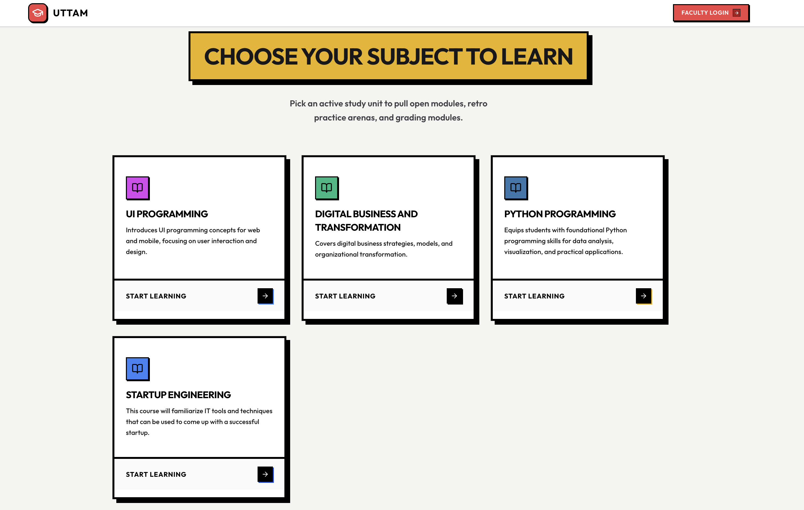
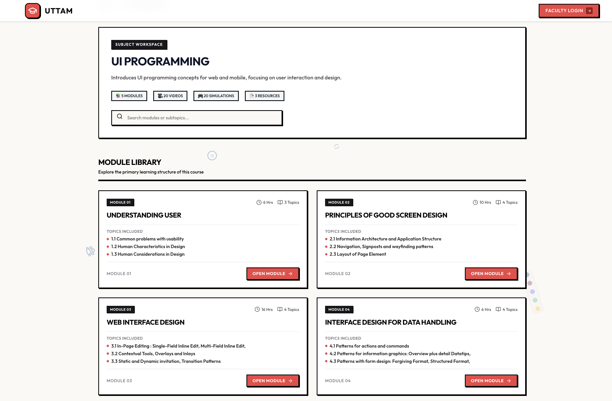
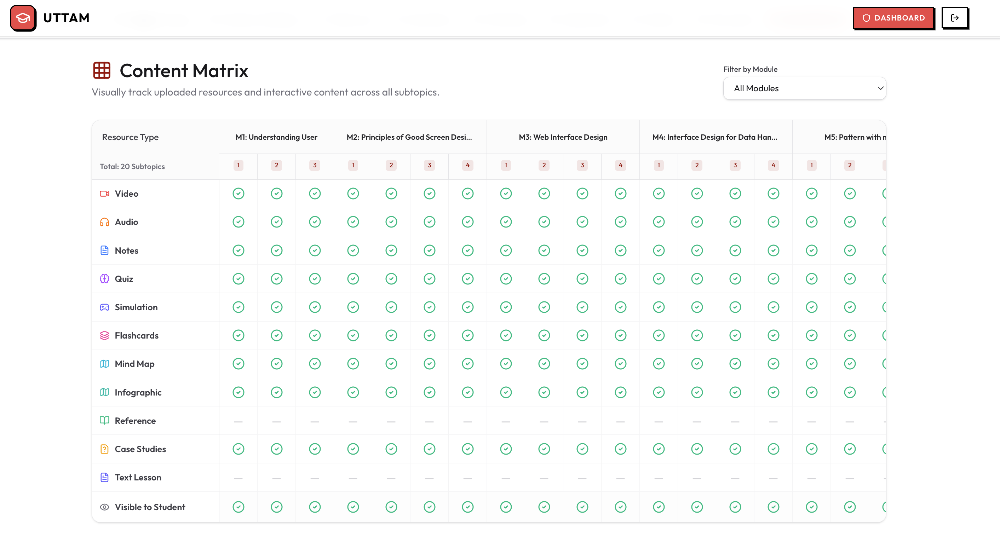
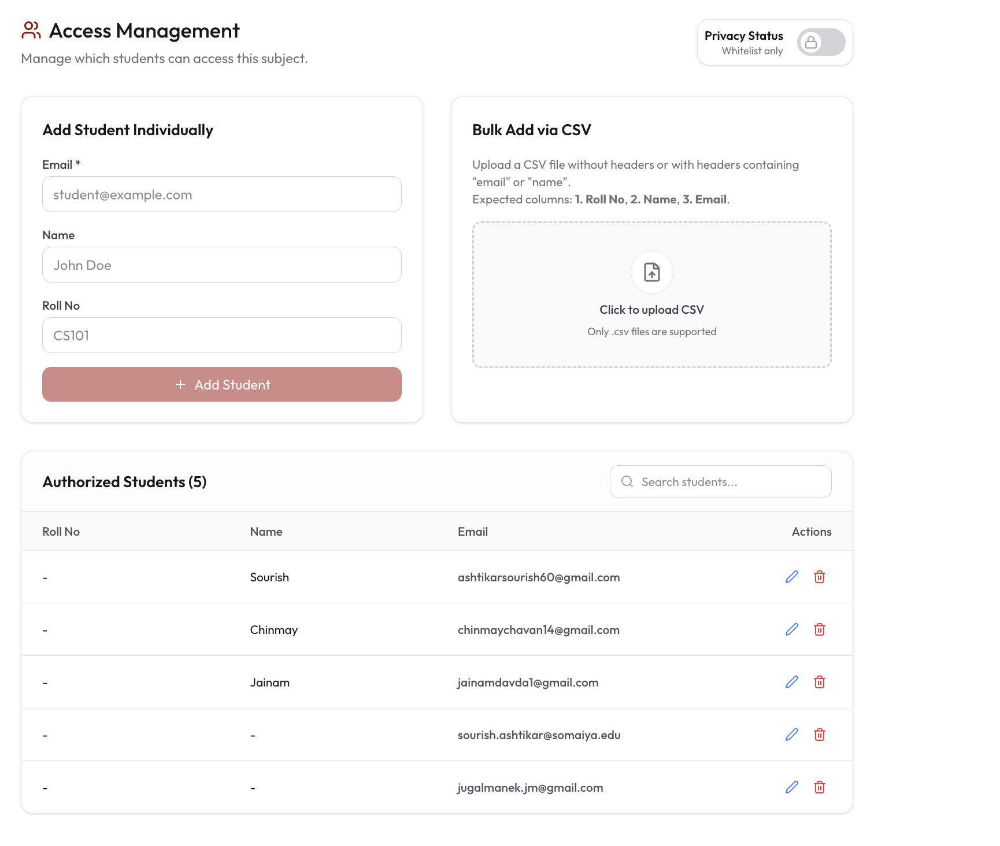

 
<div align="center">
 
###  UTTAM :  A Modern Interactive Learning Management Platform
 
**Learn · Practice · Visualize · Revise · Publish**
 
UTTAM is an interactive academic learning platform that brings structured curriculum, multimedia resources, assessments, visual learning, and faculty content management into one ecosystem.


</div>

## Overview
 
UTTAM is a modern educational platform designed to simplify the creation, organization, management, publishing, and consumption of interactive academic content.
 
Instead of treating an LMS as a place where faculty simply upload files, UTTAM organizes learning around a structured hierarchy:
 
```
Subject
  └── Module
        └── Topic / Subtopic
              └── Learning Resources
                    ├── Notes
                    ├── Did You Know
                    ├── Videos
                    ├── Audio
                    ├── Quizzes
                    ├── Flashcards
                    ├── Mind Maps
                    ├── Infographics
                    ├── Simulations
                    └── Downloadable Resources
```
 
Faculty members manage academic content through a dedicated CMS-style dashboard, while students receive a focused learning interface built around the same curriculum structure.
 
The platform uses a client-serverless architecture built around Next.js, Google Apps Script, Google Sheets, Google Drive, GitHub Actions, and GitHub Pages.
 
---
 
## Why UTTAM?
 
UTTAM is designed around a simple principle:
 
> Students should spend their time understanding concepts, not searching for them.
 
The platform combines theory, practice, visualization, and revision inside the same learning context.
 
**What it brings together:**
 
| Learning Content | Assessment & Recall | Visual Understanding |
|---|---|---|
| Structured academic curriculum | Interactive quizzes and assessments | Mind maps for visual understanding |
| Rich educational notes | Flashcards for active recall | Educational infographics |
| Video and audio learning | Faculty-side content management | Interactive simulations |
| Downloadable resources | One-click publishing workflow | |
 
---
 
## Information Architecture
 
UTTAM separates the student learning experience from the faculty content-management experience, while connecting both through the publishing pipeline.
 
<p align="center">
  
</p>

 
 website structure:
 
 
```
UTTAM
│
├── Home
├── Team
├── Sitemap
├── About / Info
│
├── Student Portal
│   ├── Subjects
│   ├── Subject Dashboard
│   ├── Modules
│   ├── Topics / Subtopics
│   └── Learning Resources
│       ├── Notes
│       ├── Did You Know
│       ├── Videos
│       ├── Audio
│       ├── Quizzes
│       ├── Flashcards
│       ├── Mind Maps
│       ├── Infographics
│       ├── Simulations
│       └── Resources
│
└── Faculty Portal
    ├── Dashboard
    ├── Subject Management
    ├── Curriculum / Content
    ├── Interactive Content
    ├── Resource Management
    └── Publish
```
 
---
 
## Core Features
 
### Student Portal
 <p align="center">
  
</p>
The Student Portal is the learning-facing side of UTTAM. Students can:
 
- Browse available subjects
- Open subject dashboards
- Navigate through modules and topics
- Read structured notes
- View educational media
- Listen to audio lectures
- Attempt quizzes
- Revise using flashcards
- Explore mind maps
- Study visual infographics
- Practice through simulations
- Access downloadable resources
**Student dashboard**
 
<p align="center">
  
</p>
The subject dashboard acts as the student's central learning workspace, exposing modules and reference material in a structured layout.
 
### Faculty Portal
 
The Faculty Portal works as the platform's content-management system. Faculty members can:
 
- Create and manage subjects
- Organize modules and subtopics
- Write and edit educational content
- Create quizzes
- Build flashcard decks
- Manage simulations
- Manage mind maps and infographics
- Upload and organize resources
- Control visibility of content
- Review curriculum coverage through the Content Matrix
- Publish updates to the student portal

**Faculty dashboard**
 
<p align="center">
  
</p>
 Interactive Learning : 
 
UTTAM is not limited to document distribution. Learning resources are designed around different modes of understanding and revision.
 
#### Quizzes & Assessments
 
Students can test their understanding using interactive assessments.
 
<p align="center">
  
</p>

Faculty quiz builder — Faculty can create and manage question-based assessments directly from the CMS.
 
<p align="center">
  
</p>


Flashcards
 
Flashcards support quick revision and active recall.
 
<p align="center">
  
</p>


Faculty flashcard builder — Faculty can create decks manually or use CSV-based workflows to populate flashcard content.

 
<p align="center">
  
</p>


Educational Simulations

 
Simulations allow students to interact with concepts rather than only reading about them.
 
<p align="center">
  
</p>

 Mind Maps : 

 
Mind maps provide visual representations of relationships between concepts and help students revise complex topics quickly.
 
<p align="center">
  
</p>

 Educational Infographics : 
 
Infographics convert dense academic information into visual learning and revision material.
 
<p align="center">
  
</p>
---
 
 
## System Architecture
 
UTTAM uses a client-serverless architecture.
 
<p align="center">
  
</p>
**Architecture layers**
 
| Layer | Responsibility |
|---|---|
| Next.js / React | Student and faculty interfaces |
| Google Apps Script | Backend API and business logic |
| Google Sheets | Structured content datastore |
| Google Drive | Media/content storage |
| GitHub Actions | Automated build and deployment |
| GitHub Pages | Static frontend hosting |
| Google OAuth | Authentication for protected access |
 
**Frontend data access**
 
All backend communication is centralized through the `fetchGAS()` utility in `src/lib/apiClient.ts`. It sends action-based requests to the Google Apps Script Web App.
 
Example:
 
```javascript
const response = await fetchGAS("getModules", {
  subjectId: "123"
});
```
 
For deployed student pages, the application can use the statically generated `data.json` instead of querying GAS for every read.
 
---
 
## Publishing & CI/CD Pipeline
 
One of UTTAM's important architectural features is its faculty-triggered publishing workflow.
 
<p align="center">
  
</p>
**Publishing flow**
 
```
Faculty updates content
        ↓
Faculty clicks Deploy
        ↓
Google Apps Script
        ↓
GitHub repository dispatch
        ↓
GitHub Actions
        ↓
Fetch latest data
        ↓
Generate data.json
        ↓
Build Next.js application
        ↓
Deploy to GitHub Pages
        ↓
Students receive published content
```
 
**Faculty deployment control**
 
<p align="center">
  
</p>
The deployment workflow keeps content management and student delivery separate while providing faculty with a simple publishing action.
 
---
 
## Technology Stack
 
| Category | Technology |
|---|---|
| Framework | Next.js 16 |
| UI | React 19 |
| Language | TypeScript 5 |
| Styling | Tailwind CSS 4 |
| Component System | shadcn/ui |
| Icons | Lucide React |
| Backend | Google Apps Script |
| Content Database | Google Sheets |
| Media Storage | Google Drive |
| Authentication | Google OAuth |
| Static Data | data.json |
| CI/CD | GitHub Actions |
| Hosting | GitHub Pages |
 
---
 
## Project Structure
 
```
UTTAM_PLATFORM/
│
├── src/
│   ├── app/
│   │   ├── student/              # Student-facing routes
│   │   └── faculty/              # Faculty CMS routes
│   │
│   ├── components/
│   │   ├── student/               # Student UI
│   │   ├── faculty/                # Faculty UI
│   │   ├── Quiz/                    # Quiz components
│   │   ├── cards/                    # Reusable content cards
│   │   ├── layout/                   # Layout components
│   │   └── ui/                       # Shared UI components
│   │
│   ├── lib/
│   │   ├── apiClient.ts          # GAS communication
│   │   └── ...                       # Utility modules
│   │
│   ├── hooks/
│   ├── types/
│   └── utils/
│
├── public/
│   ├── data.json                 # Generated static data
│   └── ...
│
├── scripts/
│   └── fetch-data.js             # Static data generation
│
├── screenshots/
│
├── documentation/
│   ├── installation_guide.md
│   ├── developer_guide.md
│   ├── faculty_guide.md
│   └── troubleshooting.md
│
├── GAS_Backend_Code.js           # Google Apps Script backend
├── ARCHITECTURE.md
├── package.json
└── README.md
```
 
---

## Faculty Workflow
 
A typical faculty workflow is:
 
1. Open Faculty Dashboard
2. Create / select Subject
3. Organize Modules
4. Add Topics / Subtopics
5. Add Learning Resources
6. Create Quizzes / Flashcards / Interactive Content
7. Review Content Matrix
8. Control Student Visibility
9. Deploy to Production
**Content hierarchy**
 
```
Subject
 ├── Module
 │    ├── Subtopic
 │    │    ├── Notes
 │    │    ├── Video
 │    │    ├── Audio
 │    │    ├── Quiz
 │    │    ├── Flashcards
 │    │    ├── Simulation
 │    │    ├── Mind Map
 │    │    ├── Infographic
 │    │    └── Resource
 │    └── ...
 └── ...
```
 
---
 
## Documentation
 
Additional technical and operational documentation is available in the repository:
 
| Document | Purpose |
|---|---|
| `documentation/installation_guide.md` | Local setup, GAS setup, OAuth, and deployment |
| `documentation/developer_guide.md` | Architecture and development workflow |
| `documentation/faculty_guide.md` | Faculty content-management workflow |
| `documentation/troubleshooting.md` | Common problems and fixes |
| `ARCHITECTURE.md` | Detailed technical architecture |
 
---
 
## Architecture Decisions & Trade-offs
 
**Why Google Sheets?**
Google Sheets provides a lightweight and accessible content datastore that faculty/admins can inspect without requiring traditional database administration.
 
**Why Google Apps Script?**
Apps Script provides a serverless backend layer tightly integrated with Google Sheets and Google services, reducing infrastructure and deployment overhead.
 
**Why static student delivery?**
The student side is primarily read-heavy. Generating static data during publishing reduces repeated backend reads and allows the student-facing application to be served efficiently from GitHub Pages.
 
**Why GitHub Actions?**
GitHub Actions provides an automated bridge between faculty publishing and the deployed student application.

 
## Security & Access
 
UTTAM uses Google authentication for protected student access and supports protected/private subject data through its application-level encryption and authorization flow.
 
The repository should keep sensitive configuration outside of source control, including:
 
- Google OAuth credentials
- Faculty authentication values
- GitHub Personal Access Tokens
- Deployment secrets
For exact implementation details, see `ARCHITECTURE.md` and the developer/installation documentation.
 
---
 
## Project Screenshots
 
The screenshots below follow the actual information architecture of UTTAM: landing → subject discovery → curriculum → learning resources → faculty management → publishing.
 
### Landing & Platform Overview
 
<p align="center">
  
  <br><em>UTTAM landing page and platform introduction</em>
</p>
<p align="center">
  
  <br><em>Additional platform overview and feature presentation</em>
</p>

Information Architecture
 
<p align="center">
  
  <br><em>Complete information architecture showing the separation between Student Portal, Faculty Portal, learning resources, and the publishing/backend layer</em>
</p>

   Student Learning Experience
 
<p align="center">
  
  <br><em>Subject discovery and navigation</em>
</p>

<p align="center">
  
  <br><em>Module-level curriculum organization</em>
</p>

<p align="center">
  
  <br><em>Centralized view of available learning resources</em>
</p>

 Interactive Learning Resources
 
<p align="center">
  
  <br><em>Interactive quiz experience</em>
</p>

<p align="center">
  
  <br><em>Flashcard-based active recall and revision</em>
</p>

<p align="center">
  
  <br><em>Interactive educational simulation</em>
</p>

<p align="center">
  
  <br><em>Visual concept mapping for learning and revision</em>
</p>

<p align="center">
  
  <br><em>Visual academic content and quick-reference material</em>
</p>

 Faculty Content Management
 
<p align="center">
  
  <br><em>Faculty dashboard for managing academic content</em>
</p>

<p align="center">
  
  <br><em>Content Matrix for tracking and organizing curriculum content</em>
</p>

<p align="center">
  
  <br><em>Faculty quiz creation interface</em>
</p>

<p align="center">
  
  <br><em>Faculty flashcard creation and management</em>
</p>

<p align="center">
  
  <br><em>Authentication and access-provider interface</em>
</p>

Publishing & Deployment
 
<p align="center">
  
  <br><em>Faculty-controlled publishing/deployment action</em>
</p>

 
<div align="center">

UTTAM
 
**Learn · Practice · Visualize · Revise · Publish**
 
*A unified learning and content-management platform for modern academic education.*
 
</div>
